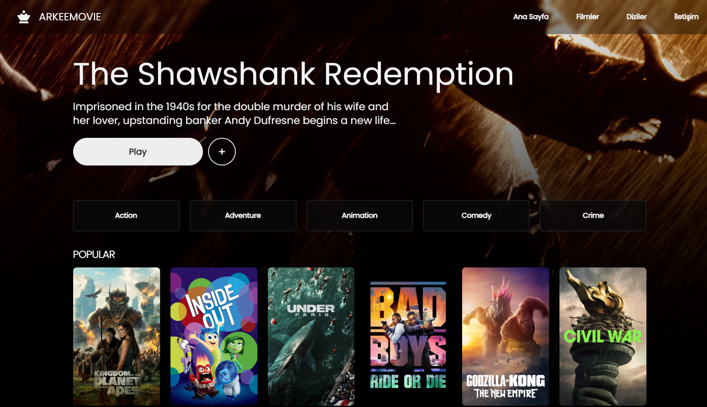
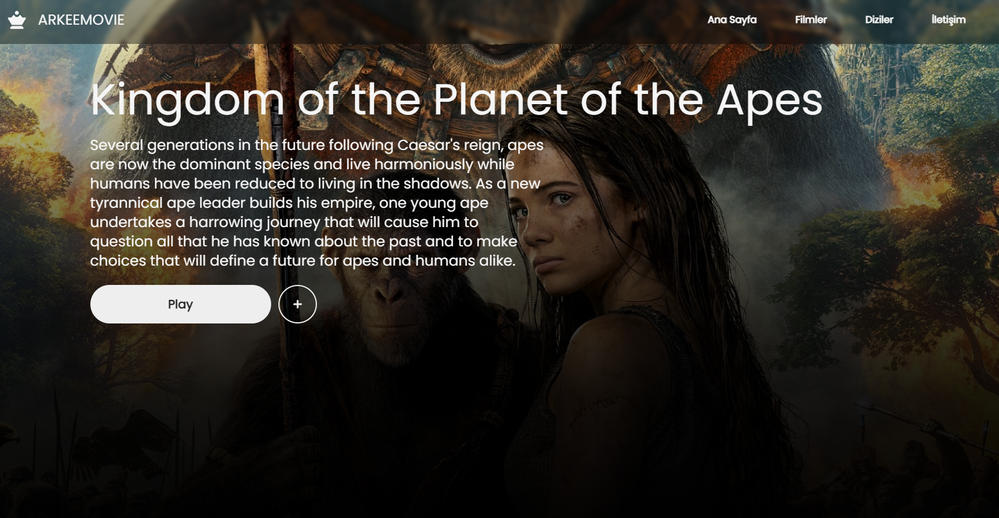

En Çok izlenen filmleri - Güncel ve Popüler filmleri takip edebileceğiniz bir next movie uygulaması

## Getting Started

First, run the development server:

```bash
npm run dev
# or
yarn dev
# or
pnpm dev
# or
bun dev
```

projeyi çalıştırdıktan sonra [http://localhost:3000](http://localhost:3000) adresine giriniz

- Next dökümantasyonu için [Next.js Documentation](https://nextjs.org/docs) adresini ziyaret edebilirsiniz 


